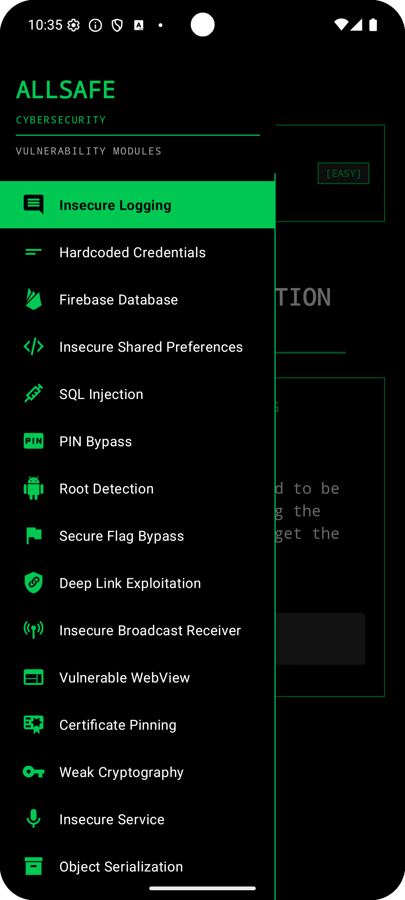
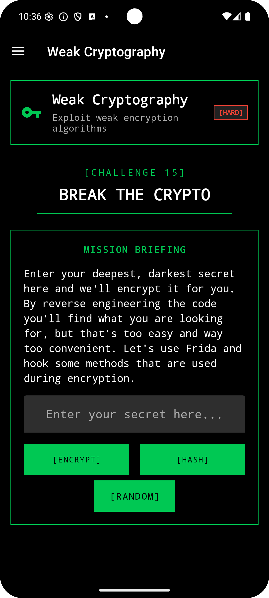
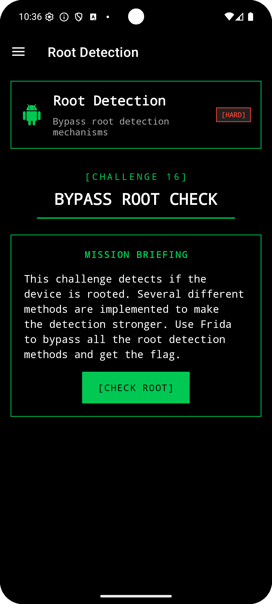

<div align="center">
  
  
  # Allsafe
  
  **An Intentionally Vulnerable Android Application for Security Education**
  
  [](https://github.com/t0thkr1s/allsafe/actions)
  [](https://www.gnu.org/licenses/gpl-3.0)
  [](https://www.android.com)
  [](https://android-arsenal.com/api?level=23)
  
  <p align="center">
    <a href="#features">Features</a> •
    <a href="#screenshots">Screenshots</a> •
    <a href="#installation">Installation</a> •
    <a href="#challenges">Challenges</a> •
    <a href="#contributing">Contributing</a> •
    <a href="#support">Support</a>
  </p>
</div>

---

## 📱 About

**Allsafe** is an intentionally vulnerable Android application designed for security enthusiasts, pentesters, and developers to learn about Android application security. Unlike typical CTF-style apps, Allsafe simulates a real-world application using modern libraries and technologies, providing a practical learning experience for identifying and exploiting Android vulnerabilities.

### 🎯 Key Features

- **15+ Security Challenges** covering various vulnerability categories
- **Modern Tech Stack** using current Android development practices
- **Frida Challenges** for dynamic instrumentation practice
- **Real-world Scenarios** that mirror actual application vulnerabilities
- **Progressive Difficulty** from beginner to advanced levels
- **Clean UI/UX** with a hacker-themed terminal interface

## 📸 Screenshots

<div align="center">
  
  
  
</div>

## 🚀 Installation

### Prerequisites

- Android device or emulator (API 23+)
- ADB (Android Debug Bridge) installed
- (Optional) Frida for dynamic analysis challenges

### Download & Install

#### Option 1: Direct APK Installation
```bash
# Download the latest APK from releases
wget https://github.com/t0thkr1s/allsafe/releases/latest/download/allsafe.apk

# Install via ADB
adb install allsafe.apk
```

#### Option 2: Build from Source
```bash
# Clone the repository
git clone https://github.com/t0thkr1s/allsafe.git
cd allsafe

# Build the APK
./gradlew assembleDebug

# Install the APK
adb install app/build/outputs/apk/debug/app-debug.apk
```

## 🎮 Challenges

The application contains various security challenges organized by difficulty:

### Challenges

### 1. Insecure Logging

Simple information disclosure vulnerability. Use the `logcat` command-line tool to discover sensitive information.

###### Resources & HackerOne Reports:

- [Logcat Tool](https://developer.android.com/studio/command-line/logcat)
- [Coinbase OAuth Response Code Leak](https://hackerone.com/reports/5314)

<details>
<summary>Show me how it's done!</summary>
<br>
<code>adb shell 'pidof infosecadventures.allsafe'</code>
<br><br>
Take output and substitue for <pid>
<br><br>
<code>adb shell 'logcat --pid [PID] | grep secret'</code>
<br><br>
</details>

---

### 2. Hardcoded Credentials

Some credentials are left in the code. Your task is to reverse engineer the app and find sensitive information.

###### Resources & HackerOne Reports:

- [Zomato Hardcoded Credentials](https://hackerone.com/reports/246995)
- [8x8 Hardcoded Credentials](https://hackerone.com/reports/412772)
- [Reverb Hardcoded API Secret](https://hackerone.com/reports/351555)

---

### 3. Root Detection

This is purely for Frida practice. Make the code believe that your device is not rooted!

<details>
<summary>Show me how it's done!</summary>
<br>
https://youtu.be/Gg-3Sw79gEI
<br><br>
</details>

---

### 4. Arbitrary Code Execution

Loading modules securely with third-party apps are not easy. Write a PoC application and exploit the vulnerability!

###### Resources & HackerOne Reports:

- [Arbitrary Code Execution via Third-Party Package Contexts](https://blog.oversecured.com/Android-arbitrary-code-execution-via-third-party-package-contexts/)

---

### 5. Secure Flag Bypass

Another Frida-based task. No real vulnerability here, just have fun bypassing the secure flag!

###### Resources & HackerOne Reports:

- [Android FLAG_SECURE Reference](https://developer.android.com/reference/android/view/WindowManager.LayoutParams#FLAG_SECURE)

---

### 6. Certificate Pinning Bypass

Certificate pinning is implemented using the OkHttp library. You have to bypass it in order to view the traffic with Burp Suite.

###### Resources & HackerOne Reports:

- [Certificate and Public Key Pinning](https://owasp.org/www-community/controls/Certificate_and_Public_Key_Pinning)
- [Coinbase Vulnerabilities](https://hackerone.com/reports/5786)

---

### 7. Insecure Broadcast Receiver

There's a vulnerable broadcast recevier in the application. Trigger it with the correct data and you're done!

###### Resources & HackerOne Reports:

- [Android Broadcasts Overview](https://developer.android.com/guide/components/broadcasts)
- [ok.ru Broadcast Receiver Exploitation](https://hackerone.com/reports/97295)
- [Bitwarden Vulnerable Broadcast Receiver](https://hackerone.com/reports/289000)

---

### 8. Deep Link Exploitation

Similar to the insecure broadcast receiver, you need to provide the right query parameter to complete this task!

###### Resources & HackerOne Reports:

- [Android Deep Linking](https://developer.android.com/training/app-links/deep-linking)
- [Grab Insecure Deep Link](https://hackerone.com/reports/401793)
- [Periscope Deep Link CSRF](https://hackerone.com/reports/583987)

---

### 9. SQL Injection

Just a regular SQL injection that you'd find in web applications. No need to reverse the code to bypass the login mechanism.

###### Resources & HackerOne Reports:

- [SQL Injection in Content Provider](https://hackerone.com/reports/291764)

---

### 10. Vulnerable WebView

You can also complete this task without decompiling the application. Pop an alert dialog and read files!

###### Resources & HackerOne Reports:

- [ownCloud WebView XSS](https://hackerone.com/reports/87835)

---

### 11. Smali Patching

In this task, you have to modify the execution flow of the application by editing the Smali code. Finally, rebuild and sign the APK!

###### Resources & HackerOne Reports:

- [Uber APK Signer](https://github.com/patrickfav/uber-apk-signer)

---

### 12. Native Library

The application uses a native library that validates the entered password. Reverse engineer the library to find the password then use Frida to hook the native method.

###### Resources & HackerOne Reports:

- [Ghidra](https://github.com/NationalSecurityAgency/ghidra)
- [Cutter](https://github.com/rizinorg/cutter)

<details>
<summary>Show me how it's done!</summary>
<br>
# TODO
<br><br>
</details>

## 🔧 Useful Tools & Resources

### Frida Scripts
Check out my collection of Frida scripts for Android pentesting:
[https://github.com/t0thkr1s/frida](https://github.com/t0thkr1s/frida)

### Recommended Tools
- **Static Analysis:** [JADX](https://github.com/skylot/jadx), [Apktool](https://ibotpeaches.github.io/Apktool/)
- **Dynamic Analysis:** [Frida](https://frida.re/), [Objection](https://github.com/sensepost/objection)
- **Network Analysis:** [Burp Suite](https://portswigger.net/burp), [OWASP ZAP](https://www.zaproxy.org/)
- **Reverse Engineering:** [Ghidra](https://ghidra-sre.org/), [IDA Pro](https://hex-rays.com/ida-pro/)

## 🤝 Contributing

Contributions are welcome! Whether you've found a bug, have a suggestion, or want to add a new challenge:

1. Fork the repository
2. Create your feature branch (`git checkout -b feature/AmazingFeature`)
3. Commit your changes (`git commit -m 'Add some AmazingFeature'`)
4. Push to the branch (`git push origin feature/AmazingFeature`)
5. Open a Pull Request

## 💖 Support

If you found this project helpful or valuable, please consider:

- ⭐ Giving it a star on GitHub
- 🐛 Reporting bugs or suggesting improvements
- 💰 Supporting through cryptocurrency donations:

**Bitcoin (BTC)**  
`bc1qd44kvj6zatjgn27n45uxd3nprzt6rm9x9g2yc8`

**Ethereum (ETH)**  
`0x1835a58E866a668C48Ee63d32432C7Fe28aF54b4`

## 📚 Learning Resources

- [OWASP Mobile Security Testing Guide](https://owasp.org/www-project-mobile-security-testing-guide/)
- [Android Security Documentation](https://source.android.com/security)
- [Frida Documentation](https://frida.re/docs/home/)
- [HackerOne Android Reports](https://hackerone.com/hacktivity?querystring=android)

## ⚠️ Disclaimer

This application is designed for **educational purposes only**. It should only be used in controlled environments where you have explicit permission. The developers assume no liability and are not responsible for any misuse or damage caused by this application.

**Do not use this application:**
- On devices you don't own
- In production environments
- For illegal purposes
- Without proper authorization

## 📄 License

This project is licensed under the GNU General Public License v3.0 - see the [LICENSE](LICENSE) file for details.

---

<div align="center">
  <sub>Built with ❤️ for the security community</sub>
  <br>
  <sub>Happy Hacking! 🚀</sub>
</div>
